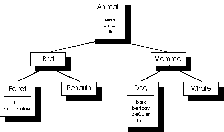

# Nesneye Yönelik Programlama Giriş

<h2 style="margin: 3px 0 3px 0; font-weight: bold"> İçerik </h2>

- Nesneye yönelik programlama nedir?
  - Kapsülleme (Encapsulation)
  - Kalıtım (Inheritance)
  - Çok biçimlilik (Polimorfizm)
- Sınıflara giriş
  - Sınıf, üye ve nesneleri
  - Sınıf bildirimi
  - Sabit nesneler ve sabit fonksiyonlar
- Yapıcı fonksiyonlar
- Yıkıcı fonksiyonlar
- Inline Fonksiyonlar


<h2 style="margin: 10px 0 3px 0; font-weight: bold" > Nesneye Yönelik Programlama Nedir? </h2>
Nesneye yönelik programlamada, programlama ortamında ki her şey bir nesne olarak kabul edilir. Bu programlama tekniğine göre her nesne bir sınıfa aittir.

<p style="margin: 20px 0 -10px 0; font-weight: bold" >Örnek: </p>
<pre>
Ahmet bir insandır. (Bu cümlede Ahmet nesnenin isim, insan sınıfın ismidir)
</pre>

<p style="margin: 20px 0 -10px 0;"> Her sınıfın özellikleri(attributes) ve eylermleri(behaviors) vardır.</p>

```cpp
// Class ifadesine ileride gelicez şuanlık bilmemize gerek yok
class Insan 
{
    // Özellikler (attributes)
    char *isim;
    char *soyisim;
    int yas;

    //Eylemler (behaviors)
    kalk();
    yuru();
    otur();
    uyu();
}
```

<h3 style="margin: 10px 0 3px 0; font-weight: bold" > Kapsülleme (Encapsulation) </h3>
Sınıf özelliklerinin dışarıya kapalı olması ve bu sınıfın her türlü veri iletişiminin kontrol altında ki metodlar ile yapılmasıdır. Bu kısımda dikkat etmeniz bir nokta vardır. Kod ve verilerimiz içinde bulundukları nesneye <b>public</b>(genel) veya <b>private</b>(özel) olarak tanımlanabilirler.

```cpp
#include <iostream>

class Araba
{
    // Özel tanımlanmış özellikler veya eylemler
    private:
    int motor_hacmi;
    int beygir_gucu;
    int tork;
    bool motor_caslisiyor = false;

    // Genel tanımlanmış özellikler veya eylemler
    public:
    void motoru_calistir()
    {
        if(!motor_caslisiyor)
        {
            motor_caslisiyor = true;
            std::cout << "Motor çalışyor...." << std::endl;
        }
        else 
        {
            std::cout << "Motor zaten çalışır durumda!" << std::endl;
        }
    }

    void motoru_durdur()
    {
        if (motor_caslisiyor)
        {
            motor_caslisiyor = false;
            std::cout << "Motor durduldu" << std::endl;
        }
        else 
        {
            std::cout << "Motor zaten çalışmıyor!" << std::endl;
        }
    }
}
```
Özel tanımlanmış özellikler sadece o nesneye ait bileşenler tarafından kullanılabilir ve çağırılabilirler. Genel tanımlanmış özellikler ise tanımlandıkları nesnelerin dışında da çağırılıp kullanılabilirler.

<h3 style="margin: 10px 0 3px 0; font-weight: bold" > Kalıtım (Inheritance) </h3>
Kalıtım, bir nesnenin diğer nesnelerin özelliklerini alabilmesidir. Bu sayede hiyerarşik bir yapı oluşturulur ve birçok bilgi bu sayede kullanılabilir.



Şemada göründüğü üzere, aslında bütün hayvan sınıfları (Bird, Mamal, Parrot, Penguin, Dog, Whale) aslında 'Animal' sınıfından kalıtım almaktadır. Bu sayede ortak özellikler olan 'answer', 'name', 'talk' gibi eylemleri(behaviors) tekrar yazmadan hiyerarşik bir şekilde kullanabiliriz.

```cpp
#include <iostream>

class Insan
{
    // Genel tanımlanmış özellikler veya eylemler
    public:
    std::string isim;
    int yas;

    /* Yapıcı fonksiyon ifadesine ileride gelicez
     * şuanlık bilmemize gerek yok
     */
    Insan(): isim("isimsiz"), yas(0) {}

    void bilgileri_goster()
    {
        std::cout << "Benim ismin: " << isim << std::endl;
        std::cout << "Benim yaşım: " << yas << std::endl;
    }
    void yuru()
    {
        std::cout << "Yürüyebilirim." << std::endl;
    }
    void uyu() 
    {
        std::cout << "Uyuyabilirim." << std::endl;
    }
};

class Yazilimci : public Insan
{
    public:
    void kod_yaz()
    {
        std::cout << "Kod yazabilirim." << std::endl;
    }
};

class Futbolcu : public Insan
{
    public:
        void futbol_oyna()
        {
            std::cout << "Futbol oynayabilirim." << std::endl;
        }
};

int main()
{
    Yazilimci yazilimci;
    yazilimci.isim = "Ahmet";
    yazilimci.yas = 22;
    yazilimci.bilgileri_goster();
    yazilimci.yuru();
    yazilimci.kod_yaz();

    Futbolcu futbolcu;
    futbolcu.isim = "Mehmet";
    futbolcu.yas = 24;
    futbolcu.bilgileri_goster();
    futbolcu.futbol_oyna();
    futbolcu.uyu();

    return 0;
}
```

<h3 style="margin: 10px 0 3px 0; font-weight: bold" > Çok Biçimlilik (Polimorfizm) </h3>
Çok biçimlilik, genel anlamıyla bir metodun farklı nesnelerden veya farklı ortamlardan fakrlı sonuçlar üretmesidir.

```cpp
#include <iostream>

class Kus
{
	public:
	void virtual ot() 
	{
		std::cout << "Kuş normal tonda ötüyor" << std::endl;
	}
};

class Kartal : public Kus
{
	public:
	void ot()
	{
		std::cout << "Kuş yüksek tonda ötüyor" << std::endl;
	}
};

class Tavuk : public Kus
{
	public:
	void ot () 
	{
		std::cout << "Kuş alçak tonda ötüyor" << std::endl;
	}
};

int main ()
{
	Kus *kus;
	Kartal kartal;
	Tavuk tavuk;

	kus = &kartal;
	kus->ot();

	kus = &tavuk;
	kus->ot();

    return 0;
}
```
<h2 style="margin: 10px 0 3px 0; font-weight: bold" > Sınıflara Giriş </h2>
Sınıflar için nesneye yönelik programlamanın kalbidir diyebiliriz. Kullanıma ve kod kısmına geçmeden önce güncel hayattan örnekler vererek, konuyu daha anlaşılır bir hale getirmeye çalışalım.

> Örneğin; bir arabaya sahip olduğumuzu düşünelim. Arabayı kullanırken arabanın sadece belli başlı parçaları ile ilişki içinde oluruz. Mesela; freni arabayı yavaşlatmak için kullanırız. Gazı, arabayı hızlandırmak veya harekete geçirmek için kullanırız. Bunlar bizim kullanabilmemiz için arabalar tasarlanırken kullanıcılara açık olan parçalarıdır. Peki biz arabanın motorunun nasıl çalıştığını, biz gaz pedalına bastığımızda arabanın içyapısında nasıl bir işleyiş olduğunu biliyor muyuz? Hayır. Bu örnekte gaz ve fren pedalımız bizim programlama da kullandığımız fonksiyonlar ile aynı anlamdadır. Arabalar tasarlanırken bize sadece bu kısımları kullanma izni veriliyor. Biz bu fonksiyonları (gaz, fren) kullanarak arabanın içyapısındaki, bizim doğrudan erişemediğimiz fonksiyonlara ulaşıyoruz. Böylece o fonksiyonlara erişim sağlayabiliriyoruz.

<h3 style="margin: 10px 0 3px 0; font-weight: bold" > Sınıf, Üye Ve Nesneleri </h3>
C++'da sınıf bildirimi yapılırken <b>class</b> anahtar sözcüğü kullanılır.

```cpp
class sinifadi
{
    // Özel tanımlanmış özellikler veya eylemler
    private:
    veriler;
    fonksiyonlar;

    // Genel tanımlanmış özellikler veya eylemler
    public:
    veriler;
    fonksiyonlar;
}nesne_listesi;
```
> :notes: Sınıf sonundaki nesne listesini `main()` fonskiyonunun içinde de tanımlayabiliriz.

```cpp
#include <iostream>

class Kare
{
    private:
    int taban;
    int yukseklik;

    public:
    const int& get_taban() const
    {
	    return taban;
    }

    void set_taban(int taban)
    {
	    this->taban = taban;
    }

    const int& get_yukseklik() const
    {
	    return yukseklik;
    }

    void set_yukseklik(int yukseklik)
    {
	    this->yukseklik = yukseklik;
    }

    int alan_hesapla()
    {
        if(taban + yukseklik <= 0) return 0;
        
        return taban * yukseklik;
    }

    int cevre_hesapla()
    {
        if(taban + yukseklik <= 0) return 0;

        return 2 * (taban + yukseklik);
    }
};

int main()
{
	Kare kare;
	kare.set_taban(5);
	kare.set_yukseklik(5);

	std::cout << "Karenin alanı: " << kare.alan_hesapla() << std::endl;
	std::cout << "Karenin çevresi: " << kare.cevre_hesapla() << std::endl;

    return 0;
}
```

<h3 style="margin: 10px 0 3px 0; font-weight: bold" > Sabit nesneler Ve Sabit Fonksiyonlar</h3>

Programlamlamadaki en önemi noktalardan birisi de veri güvenliğidir. Nasıl ki değişken tanımlarken bir değişkeni `const` ile ifade ederek o değişkeni tamamen değişmez olmasını sağlıyorsak, nesneye yönelik programlamada da `const` nesne ve fonksiyonları kullanarak programlarımızıda bazı sabitleri daha garantili ve daha güvenli bir yolla belirtmiş oluruz.

```cpp  
#include <iostream>

class SabitOrnek
{
	private:
	int sayi;

	public:	
	// Yapıcı fonksiyon şuanlık bilmemize gerek yok.
	SabitOrnek()
	{
		sayi = 0;
	}
	
	int sayi_getir()
	{
		return sayi;
	}       

	void sayi_ata(int x) const
	{
		sayi = x;
	}
};

int main()
{
	const SabitOrnek sabit_ornek1; //Nesne sabit olarak tanımlandı
	SabitOrnek sabit_ornek2; // Nesene sabit olarak tanımlanmadı
	
    /* Sabit bir objeden veri alınabilir 
	 * fakat veri gönderilemez.
	 */

	sabit_ornek1.sayi_ata(5); // HATA
	std::cout << sabit_ornek1.sayi_getir() << std::endl; // HATA YOK
	
	sabit_ornek2.sayi_ata(10); // HATA YOK
	std::cout << sabit_ornek2.sayi_getir() << std::endl; // HATA YOK
	
	return 0;
}
```

<h2 style="margin: 10px 0 3px 0; font-weight: bold" > Yapıcı Fonksiyonlar</h2>

- Oluşturduğumuz sınıflar içerisinde yer alan herhangi bir değişkene başlangıç değeri verebilmek için yapıcı fonksiyonlar kullanılır.
- Bir nesene oluşturduğumuz zaman o nesnenin yapıcı fonksiyonu otomatik olarak çağırılmaktadır.
- Yapıcı fonksiyonun ismi sınıf ismi ile aynı olmak zorundadır.
- Değer döndürmezler bu yüzden `return` gibi bir geri dönüş türü yoktur.
- Sadece bir kere çağırılır.
- Argüman alabilirler.

```cpp
#include <iostream>

class Sayilar
{
	public:
	int a, b, c;
	Sayilar(int a, int b, int c)
	{
        // This anahtar kelimesini şuanlık bilmemize gerek yok
		this->a = a;
		this->b = b;
		this->c = c;
	}

	std::string bilgileri_getir()
	{
		return std::to_string(a) + "\n" +
			std::to_string(b) + "\n" +
			std::to_string(c);
	}
};

int main()
{
	Sayilar sayilar(15, 5, 25);
	std::cout << sayilar.bilgileri_getir() << std::endl;

    return 0;
}
```
<h2 style="margin: 10px 0 3px 0; font-weight: bold" > Yıkıcı Fonksiyonlar</h2>

- Nesneler yok edileceği zaman çalışan fonksiyonlardır.
- Yapıcı fonksiyonlarda olduğu gibi sınıf ismi ile isimleri aynı olamak zorundadır. Tek farkları isimlerinin başında `~` (tida) işaretinin olması gerekliliğidir.
- Yapıcı fonskiyonda olduğu gibi tanımlanmazsa derleyici tarafından otomatik olarak tanımlanır.
- Değer döndürmezler.
- Argüman almazlar.
- Bir sınıf içerisinde sadece bir adet yıkıcı fonksiyon olabilir.

```cpp
#include <iostream>

class Sayilar
{
	public:
	int a, b, c;

	Sayilar(int a, int b, int c)
	{
		this->a = a;
		this->b = b;
		this->c = c;
	}

	~Sayilar()
	{
		std::cout << "Fonksiyon yıkıldı" << std::endl;
	}

	std::string bilgileri_getir()
	{
		return std::to_string(a) + "\n" +
			std::to_string(b) + "\n" +
			std::to_string(c);
	}
};

int main()
{
	Sayilar sayilar(5, 15, 35);
	std::cout << sayilar.bilgileri_getir() << std::endl;

    return 0;
}
```

<p style="margin: 0 0 -10px 0">Output:</p>

```
5
15
35
Fonksiyon yıkıldı
```

<h2 style="margin: 10px 0 3px 0; font-weight: bold" > Inline Fonksiyonlar</h2>

> `inline` belirtecini fonksiyonun geri dönüş tipinin önüne yerleştirmek derleyiciye; o fonksiyon derleyiciye fonksiyonun çağrısı yerine, fonksiyonun kullanıldığı yerde yaratılmasını “tavsiye eder”.

> Inline belirteci sadece küçük ve sık kullanılan fonksiyonlar için kullanılmalıdır. Nedeni; inline fonksiyonun kullanıldığı yere kopyalanmasını sağladığı için programın boyutunu artırır ve yavaşlamasına neden olur.

```cpp
#include <iostream>

#include <iostream>

using namespace std;

inline int dikdortgen_alan(int taban, int yukseklik)
{
	return taban * yukseklik;
}

int main()
{
    int taban, yukseklik;

    cout << "Dikdörtgenin taban uzunluğunu giriniz: ";
    cin >> taban;

    cout << "Dikdörtgenin yükseklik uzunluğunu giriniz: ";
    cin >> yukseklik;

	cout << "Dikdörtgenin alanı: " << dikdortgen_alan(taban, yukseklik) << endl;

	return 0;
}
```